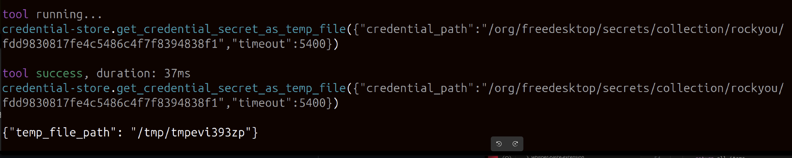

# keepassxc-dbus-mcp

## At a Glance
- Helps your agent manage credentials (including ssh keypairs) in a KeePassXC DB group
- Provides tools: 
  - `get_credential_detail`
  - `get_credential_secret`
  - `get_credential_secret_as_temp_file`
  - `create_credential`
  - `update_credential`
  - `delete_credential`
  - `list_credentials`
  - `search_credentials`
  - `create_keypair`
  - `save_keypair`
  - `retrieve_keypair`
  - `list_keypairs`
  - `delete_keypair`

Enables:
- "Can you generate a ssh pair and copy it over to `host`?"
- "Can you create dummy credentials for MSSQL and deploy it on docker?"

Following system instructions is sufficient:
```
* **Credentials at vault:** use the credential helper tool to store new credentials and fetch existing ones when needed.
```

## Description

An MCP stdio server that brokers secure access to credentials stored in KeePassXC via the FreeDesktop.org Secret Service API. It exposes a minimal set of tools to list, search, create, update, delete, and securely retrieve secrets. Unlock requests always go through KeePassXC’s native approval prompts.

Why this exists: it lets local agents fetch secrets securely without copying them into env vars or logs. Secrets are never printed to stdout and plaintext retrieval is gated off by default. Primarily prevents my credentials leaking into LLM interactions and helps me set up secure development environments. Can potentially be used to rotate passwords in an agentic manner. I use it extensively and found value in it, so I decided to share.


## Features
- Secret Service client: Uses `secretstorage` over D‑Bus; works with KeePassXC.
- Safe retrieval: Returns secrets via a 0600 temp file with auto‑delete timer.
- Plaintext gate: Direct plaintext output is disabled unless explicitly enabled.
- Clean stdio: Logs go to stderr so MCP JSON‑RPC on stdout remains pristine.
- Unit + headless D‑Bus tests: E2E tests optionally integrate with KeePassXC.

## Security Model
- User consent: Unlocks trigger KeePassXC prompts; user approval is required.
- No stdout leakage: The server never prints secrets or logs to stdout.
- Temp files: `get_credential_secret_as_temp_file` writes to a 0600 file and schedules deletion; configure timeout per call.
- Plaintext off by default: `get_credential_secret` is blocked unless `ALLOW_PLAINTEXT_SECRET=true` is set.
- Scope separation: Run as an unprivileged user; do not expose the stdio process directly to the network without a trusted MCP client in front.

## KeePassXC Secret Service Settings (strongly recommended)
- Enable Secret Service: Settings → Secret Service → "Enable KeePassXC Freedesktop.org Secret Service integration".
- Authorization tab: enable all of the following for best safety when using agents:
  - Show notification when passwords are retrieved by clients
  - Confirm when passwords are retrieved by clients
  - Confirm when clients request entry deletion
  - Prompt to unlock database before searching
These settings ensure human-in-the-loop confirmations and visibility whenever an agent accesses or deletes secrets.

<div align="center">
  
</div>

Hardening (suggested): you can expose only a specific group to the Secret Service rather than the entire database. Create a group (for example, "System Exposed") and select it under "Exposed database groups" in KeePassXC.

<div align="center" style="margin-top: 8px;">
  
</div>

## Quick Start
1) Prerequisites
   - Python 3.10+
   - KeePassXC with FreeDesktop Secret Service enabled
   - `uv` for dependency and venv management

The server works across modern Linux desktops; ensure KeePassXC is the active Secret Service provider and that your session exposes the user D‑Bus (see the Codex CLI / D‑Bus section below).

2) Install
   - Dev: `uv sync --extra dev`
   - Runtime only: `uv sync`

3) Run (stdio MCP)
   - `uv run -m keepassxc_dbus_mcp.mcp_server`
   - or after install: `uv run keepassxc-dbus-mcp`

## Tools
Use these from your MCP client.

- `list_credentials()` → `[{ path, label, attributes }]`
- `get_credential_detail(credential_path)` → attributes dict or 404
- `search_credentials(q)` → contains-based list
- `create_credential({ label, password, username?, url?, notes?, attributes? })` → `{ path }`
- `update_credential({ credential_path, label?, password?, username?, url?, notes?, attributes? })`
- `delete_credential(credential_path)`
- `get_credential_secret_as_temp_file(credential_path, timeout=60)` → `{ temp_file_path }`
- `get_credential_secret(credential_path)` → gated by env variable

## SSH Keypairs
Two‑item aggregate linked by `KeypairID`.

- `create_keypair({ label, email, passphrase?, generate_passphrase?, algorithm='ed25519' })` → `{ keypair_id, private_path, meta_path, fingerprint, public_key_ssh }`
- `save_keypair({ keypair_id?, label, email, private_key_pem, public_key_ssh, passphrase?, algorithm })`
- `retrieve_keypair({ keypair_id? | credential_path?, include_passphrase?=false })` → `{ private_key_temp_file, passphrase_temp_file?, public_key_ssh, ... }`
- `list_keypairs()` → `[{ keypair_id, label, type, email, sha } ]`
- `delete_keypair(keypair_id)`

### Using passphrase‑protected private keys (SSH askpass)
- The `retrieve_keypair` tool returns temp file paths for both private key and passphrase (if any). You can use any SSH_ASKPASS program, or generate a tiny temp script that prints the passphrase from that file:
  - Example: `ASKPASS=$(mktemp); printf '#!/usr/bin/env bash\ncat "$SSH_KEY_PASSPHRASE_FILE"\n' > "$ASKPASS"; chmod +x "$ASKPASS"`
  - Then run: `SSH_ASKPASS_REQUIRE=force SSH_ASKPASS="$ASKPASS" SSH_KEY_PASSPHRASE_FILE=/path/to/pass.tmp ssh -i /path/to/priv.tmp user@host`
  - Remove the temp script and files when done.

### SSH Keypair Storage Model (Why two entries?)
- Each SSH keypair is stored as an aggregate consisting of two Secret Service items linked by a shared `KeypairID`:
  - Private item:
    - Secret: the private key (OpenSSH PEM)
    - Attributes: `Aggregate=ssh-keypair`, `Part=private`, `KeypairID=<UUID>`, `Algorithm=ed25519`, `Fingerprint=SHA256:...`, `Email=<email>` (also mirrored in `UserName`), `Title=<label>`
  - Meta item:
    - Secret: the passphrase (empty if none)
    - Attributes: `Aggregate=ssh-keypair`, `Part=meta`, `KeypairID=<UUID>`, `Algorithm=ed25519`, `Fingerprint=SHA256:...`, `PublicKeyOpenSSH=<ssh-ed25519 ...>`, `Email=<email>`, `Title=<label>`
- Rationale: secrets are cleanly separated (private key vs. passphrase), and both remain first-class Secret Service items that KeePassXC can manage (unlock prompts, approvals). We avoid stuffing binary material into attributes.
- What you’ll see in KeePassXC: two entries with the same title/username; one is the private part, the other is the meta part. They belong together. The server groups them using `KeypairID`.
- How to work with them:
  - Discover: `list_keypairs()` shows `{ keypair_id, label, type, email, sha }` for quick selection.
  - Use: `retrieve_keypair()` gives temp file paths for private key and (optionally) passphrase.
  - Update: `save_keypair()` can create new or update an existing pair by `keypair_id` and keeps both entries in sync.
  - Delete: remove both entries with the same `KeypairID` (call `delete_credential` for each path). A dedicated delete-keypair tool can be added if needed.

## Environment Variables
- `LOG_LEVEL`: Default `INFO`. Use `DEBUG` for troubleshooting (still stderr).
- `ALLOW_PLAINTEXT_SECRET`: Default `false`. Set to `true` only for trusted local use or tests.
- `PREFER_SHM`: Default `true`. When enabled, secrets are written to a temp file on `/dev/shm` (tmpfs) if available, minimizing disk persistence. If `/dev/shm` is not writable, the helper automatically falls back to the system temp directory.

## Codex CLI / D‑Bus Environment
- Why: the helper connects to KeePassXC through the FreeDesktop.org Secret Service on the user’s D‑Bus session bus. When sessions are launched by tools (e.g., Codex CLI, tmux, systemd units, SSH), `DBUS_SESSION_BUS_ADDRESS` and/or `XDG_RUNTIME_DIR` may be missing. In that case, `secretstorage` cannot reach the bus and you’ll see errors like “No D‑Bus session bus” or “org.freedesktop.secrets not provided by any .service files”.
- Fix: ensure your agent/CLI session inherits the user bus:
  - `XDG_RUNTIME_DIR=/run/user/<uid>` (1000 on most single‑user desktops)
  - `DBUS_SESSION_BUS_ADDRESS=unix:path=/run/user/<uid>/bus`
  - KeePassXC must be running and providing Secret Service (see settings above).
- Codex example (`config.toml`):

  ```toml
  [mcp_servers.credential-store]
  command = "uv"
  args = ["--directory", "/home/keepassxc-dbus-mcp", "run", "-m", "keepassxc_dbus_mcp.mcp_server"]
  ## IMPORTANT for DBus-based servers (like KeePassXC Secret Service):
  ## Codex launches MCP servers with a minimal environment (env_clear), so DBus
  ## variables like XDG_RUNTIME_DIR and DBUS_SESSION_BUS_ADDRESS are not inherited
  ## by default. Provide them explicitly here so the server can connect to your
  ## session bus. Adjust the UID/path to your system as needed.
  ##
  ## Tip: echo $XDG_RUNTIME_DIR and $DBUS_SESSION_BUS_ADDRESS in your shell and
  ## paste the values below.
  env = { XDG_RUNTIME_DIR = "/run/user/1000", DBUS_SESSION_BUS_ADDRESS = "unix:path=/run/user/1000/bus", PYTHONPATH = "src" }
  ```

- Quick verify:
  - `gdbus introspect --session --dest org.freedesktop.secrets --object-path /org/freedesktop/secrets | head`
  - or: `python -c 'import secretstorage; secretstorage.dbus_init()'`

## Troubleshooting
- Not seeing KeePassXC prompts: Verify KeePassXC is the active Secret Service provider (Settings → Secret Service Integration) and that your desktop didn’t start a competing provider.
- Unlock timing issues: The service includes a bounded polling loop after `unlock()` to handle signal timing; try again with `LOG_LEVEL=DEBUG` and check stderr.
- Temp file not deleted: The deletion happens in‑process via a timer. If the process exits early, manually remove the file; consider shorter timeouts.

## Field Mapping Notes (KeePassXC)
- KeePassXC exposes default entry fields via Secret Service using exact, case‑sensitive keys: `Title`, `UserName`, `URL`, `Notes` (and `Password`, which is retrieved separately as the secret).
- Simplified model: typed fields (`label`, `username`, `url`, `notes`) populate canonical keys. The `attributes` bag is for custom keys only; reserved keys are ignored.
- Reserved keys: `Title`, `UserName`, `URL`, `Notes`, `Aggregate`, `Part`, `KeypairID`, `Algorithm`, `Fingerprint`, `Email`, `PublicKeyOpenSSH`.

## Searching
- Contains search: case‑insensitive "contains" across `label`, `path`, `Title`, `UserName`, `URL`, `Notes`, and all custom attribute keys and values.
- Normalization: Unicode NFKD + ASCII fold; non‑alphanumerics collapse to spaces. This makes `mssql dummy` match `mssql-dummy`.

## Examples
- Free‑text contains search:
  - `search_credentials("demo")`
  - `search_credentials("mssql dummy")`  (matches labels like `mssql-dummy`)

## Screenshots (flow overview)

 - Access request: database interactions trigger the KeePassXC prompt. You can choose not to remember and reset remembered decisions at any time.

  <div align="center">
    
  </div>

 - Search credentials: quick free‑text query showing attributes returned by `search_credentials`.

  <div align="center">
    
  </div>

- Retrieve secret to a temp file: using `get_credential_secret_as_temp_file` — secrets never hit stdout; files auto‑delete after the timeout.

  <div align="center">
    
  </div>


- Safe usage in function calls:

  <div align="center">
    
  </div>

## Tested Environment
- OS: Ubuntu 24.04.3 LTS (Noble)
- Kernel: Linux 6.8.0-64-generic x86_64
- Desktop: GNOME Shell 46.0 (X11 session; `XDG_SESSION_TYPE=x11`)
- Secret Service provider: KeePassXC 2.7.10
